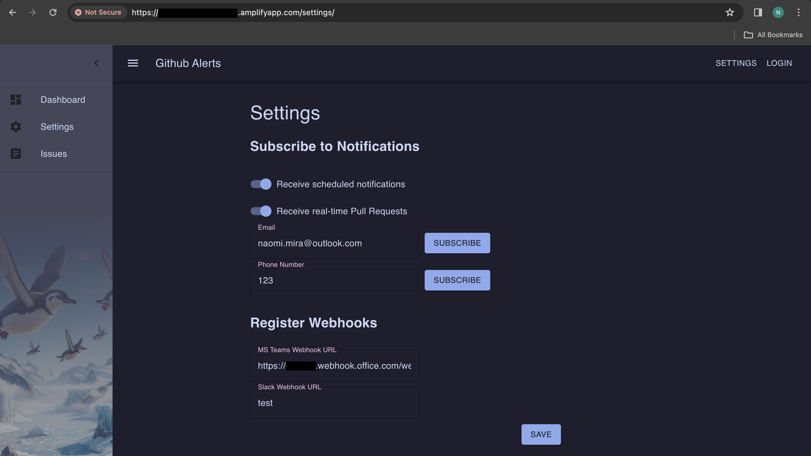
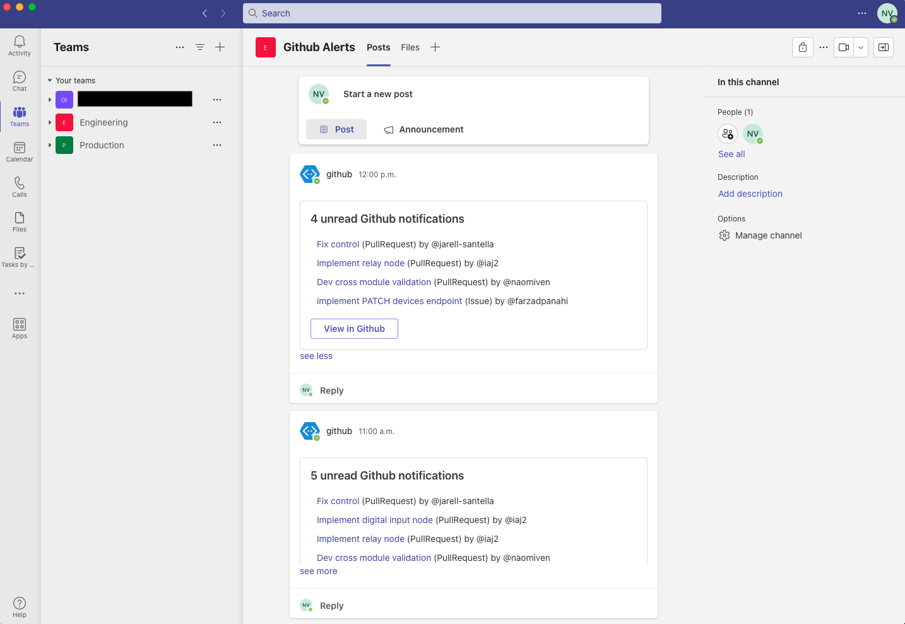
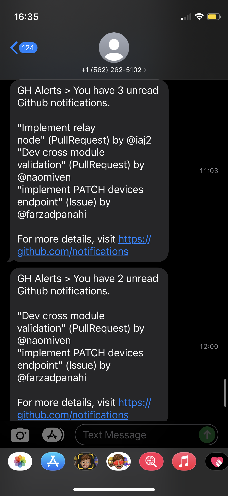

# Github Alerts

:rocket: Turbocharge your Github workflow with Github Alerts!

:star2: Never miss a beat with instant PR reviews and notifications right to your email, phone, or Microsoft Teams app!

:cloud: Seamlessly built in the Cloud, this app leverages the power of event-driven architecture to ensure you're always on top of your game!

:tada: Stay ahead, stay updated, and skyrocket your productivity today!

Thank you for stopping by! :)

## Technology Used

**Backend**: Python, Flask, AWS (SNS, Elastic Beanstalk, Lambda, DynamoDB, EventBridge), MS Teams Webhook

**Frontend**: React.js, Material UI, HTML, CSS, AWS Amplify

## Screenshots

Configuring alert settings in the application



Microsoft Teams notifications



SMS text notifications



## Backend

### Test backend locally

Install dependencies

```python3
cd backend
python3 -m venv venv
source venv/bin/activate
pip install -U pip
pip install -r requirements-test.txt
```

Run app

```sh
flask --app app --debug run
```

In a new terminal

```sh
curl http://localhost:5000/
> Welcome to Naomi's app :D
```

### Deploy the Backend

#### Create a new application

```sh
eb init -p python-3.9 gh-alerts --region <aws-region>

# Configure a default keypair in order to connect to the EC2 instance that hosts your app
eb init

# Create environment and deploy
eb create gh-alerts

# Set environment variables
cd scripts
./set_envs.sh
```

In configuration settings, ensure that the EC2 instance profile points to the IAM role `gh-alerts-role` and WSGI Path is set to `app:app`

#### Deploy to an existing application

```sh
eb deploy
```

#### Config

To update the configuration of the backend:

`set_envs.sh`: Sets the environment variables for the backend in Elastic Beanstalk.

`update_policy.sh`: Updates the IAM policy (attached to IAM role) of the backend's EC2 instance profile. This policy contains permissions for accessing specific AWS resources.

#### Configure HTTPS

To configure HTTPS, a server certificate must be assigned to the environment's load balancer.

To create and self-sign a certificate, upload it to IAM, and assign it to the load balancer, run:

```sh
cd scripts
./gen_certs.sh
./upload_cert.sh
./assign_cert.sh
```

**NOTE** We are self-signing for development purposes only!

#### Test

To test if the backend has been deployed properly

```bash
$ curl http://gh-alerts.<domain>.<aws_region>.elasticbeanstalk.com
> Welcome to Naomi's app :D
```

#### Terminate Backend environment

To avoid incurring charges to unused AWS resources, terminate the environment.

```bash
eb terminate
```

### Deploy Lambda function

```sh
cd <root-dir>/lambda/scripts
./deploy.sh
```

## Lambda Function

The `deploy.sh` script executes the steps below in order:

1. `update_config.sh`: Updates the lambda function's environment variables
2. `deploy_lambda.sh`: Installs dependencies and deploys the lambda function

Ensure the timeout of the lambda is greater than the timeout of the post request to the MS Teams webhook.

### EventBridge Scheduler

Trigger the lambda at a scheduled rate using EventBridge Scheduler. To trigger every hour from 9:00 - 17:00, Monday to Friday, use cron expression:

```sh
0 9-17 ? * MON-FRI *
```

## Frontend

NPM and Node versions used:

```sh
npm -v
9.8.0
node -v
v20.5.1
```

### Test frontend locally

```sh
npm start
```

### Deploy the Frontend

#### Prerequisites

Install the AWS Amplify CLI

```bash
npm install -g @aws-amplify/cli
```

Configure Amplify CLI with your AWS account and follow the instructions.

```bash
amplify configure
```

#### Initialize Amplify environment

```bash
# Build project to ensure it is ready for production
npm run build

# Initialize amplify and answer some questions about the project
amplify init

# Add hosting to project & follow the instructions
amplify add hosting
```

#### Deploy using Amplify console

For automatic continuous deployment, hosting is added to the app. Once Github is connected, the app can be built & deployed directly from AWS Amplify console.

Environment variables are manually added using the console.

Edit `amplify.yml` under "Build settings" to set the root of the project to `frontend` and add build commands:

```yml
version: 1
frontend:
  phases:
    # IMPORTANT - Please verify your build commands
    build:
      commands:
        # added
        - cd frontend
        - npm install
        - npm run build
        - cp src/index.css build/ # temporary solution because index.css is not being added to build
  artifacts:
    # IMPORTANT - Please verify your build output directory
    baseDirectory: frontend/build # added
    files:
      - '**/*'
  cache:
    paths: []
```

Since this React app uses client-side routing (with React Router), all server requests must be redirected to `index.html`, allowing React Router to handle the routing. Under "Rewrites and redirects", add the following rule:

```txt
Source address: </^[^.]+$|\.(?!(css|gif|ico|jpg|js|png|txt|svg|woff|ttf)$)([^.]+$)/>
Target address: /index.html
Type: 200 (Rewrite)
```

#### Terminate Frontend environment

```bash
amplify delete
```

### Theme

This app's color theme is inspired by [catpuccin](https://github.com/catppuccin/catppuccin).

The background image for the sidebar drawer is AI-generated using ChatGPT's DALL-E.
